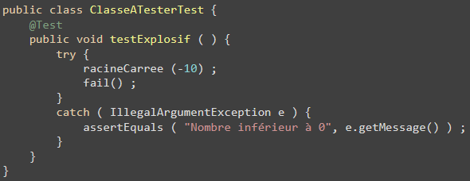
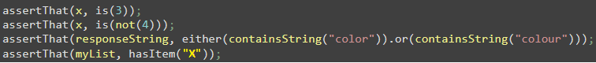
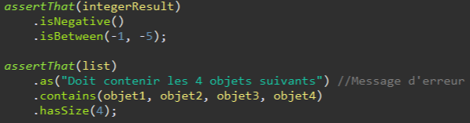

 # JUnit : 
 # Fonctionnalités plus avancées

--
# Tester les exceptions

 * __Possibilité de vérifier la levée d’Exception avec JUnit 4, avec l’attribut « expected » :__ 

    ```java
        @Test(expected = MonException.class)
        public void testMaMethodeException(){...}
    ```

 * __Possible en utilisant `Assert.fail()` aussi__ 

--
# Tester les exceptions

 * __Ex:__ 
 <br/>


--
# Les Hooks

 * __Méthode permettant la mise en place du contexte de test :__ 

 * __Permet par exemple la création du jeu de données\, la mise en place d’une BDD pour les tests\, le nettoyage etc\.__ 

--
# Les Hooks

| Annotation      | Rôle                                                             |
|-----------------|------------------------------------------------------------------|
| __@Before__     | Exécutée avant chaque méthode préfixée par `@Test`               |
| __@BeforeClass__| Exécutée une fois avant l'exécution de la classe de test         |
| __@After__      | Exécutée après chaque méthode préfixée par `@Test`               |
| __@AfterClass__ | Exécutée une fois après l'exécution de la classe de test         |

--
# Les Matchers

*  __Outils plus avancés pour réaliser des assertions__ 
*  __L’objet à tester et le « matcher » sont passés à la méthode : `Assert.assertThat(...)`__
*  __Contraintes plus élaborées comme : « est égal et inférieur à », « la chaîne contient tel mot mais pas tel autre » etc\.__ 

--
# Les Matchers

 *  __Ex avec la librairie Harmcrest :__
<br/> 
 * __La librairie Hamcrest permet de bénéficier de fonctionnalités de Matcher plus complète encore (cf correction exercice 1)__

--
# AssertJ

* __Une librairie de matchers plus récente__ 

* __Synthaxe plus lisible et fluide__ 

* __Bonne articulation avec JUnit 5__ 

* __Ex :__
<br/> 


--
# D’autres fonctionnalités

* __Ignorer un test : `@Ignore`__

* __Assume : Test de conditions d’exécution du test__

* __Tests paramétrés : Répéter un test avec des paramètres différents, par ex. depuis un fichier CSV__

* __Test timeout : Tester le temps d’exécution__

* __`@Rule` : Mise en place de composant complexe utile au test (ex : BDD embarquée Posgres avec TestContainer)__