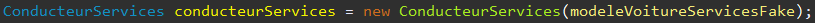
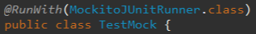
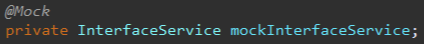
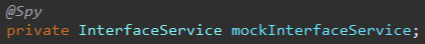

# Isolation des tests :
# Les Fakes et les Mocks

--
# Introduction

*  __Principe de test : une classe → un test__ 
*  __En mode test « unitaire » : On ne teste normalement que le code de la classe__
* __Mais alors...__

--

# Questions ?
*  __Comment faire pour les autres classes qui sont appelées par le code ? \(ex : autres classes service\)__ 
*  __Comment faire pour les services extérieurs disponibles en environnement de production seulement ? \(ex : BDD\, messagerie\, annuaire…\)__ 
*  __Comment faire pour tester le bon comportement en cas d’erreur difficile ou impossible à reproduire ? \(ex : réseau\)__ 


--
# Solution : La simulation

*  __On va chercher à reproduire le comportement d’une classe sans l’appeler réellement__ 
*  __Définition « ad hoc » des résultats attendus pour des paramètres données__ 
*  __Plusieurs solutions de mise en œuvre :__ 
    *  __Solution manuelle : les Fakes__ 
    *  __Solution outillée : les Mocks__ 


--
# Les Fakes

* __Réalisation d’une « fausse » classe de service pour un test donnée__ 

* __Contraint à créer un constructeur permettant l’injection du fake \(injection de dépendance\) :__ 

* __Le Fake implémente l’interface de service__ 

--
# Les Fakes

* __Les méthodes sont défini pour renvoyer un résultat correspondant au contexte du test__ 

* __Inconvénient : long à développer__ 

__→ Utiliser un outil adéquat : les Mocks__ 

--
# Les Mocks

*  __Utilisation de librairies permettant la génération de « mocks »__ 
*  __Mock : Classe qui porte le même nom mais dont chaque méthode par défaut ne fait rien__ 
*  __La librairie comporte des méthodes pour configurer le comportement du mock__ 

--
# Les Mocks :

* __Pour quels usages ?__
    *  __Simuler le comportement classe externes__
    *  __Simuler appel services extérieurs \(api\, messagerie\, annuaire\.\.\.\)__
    *  __Pouvoir développer certains composants avant que d’autres ne soient développés \(ex: prestation\)__
    *  __Simuler des erreurs complexes à reproduire \(ex :réseau\)__
    *  __Pouvoir contrôler les méthodes qui sont appelée sur les mocks__

--
# Les Mocks : Mise en œuvre

* __Plusieurs librairies sur le marché : Mockito\, PowerMock\, EasyMock…__ 

* __La plus répandue : Mockito__ 

--
# Mockito : Exemple

* __Par défaut le Mock ne fait rien et renvoie null à chaque méthode__
* __On définit au cas par cas son comportement selon les cas de test__
* __Exemple d'utilisation :__

```java [1|2|3|4|5|6]
User user = Mockito.mock(User.class);
System.out.println(user.getLogin()); // affiche null
user.setLogin("bob");
System.out.println(user.getLogin()); // affiche encore null !
Mockito.when(user.getLogin()).thenReturn("bob");
System.out.println(user.getLogin()); // affiche "bob"
```

--
# Les Mocks : Annotations

* __Les méthodes plus récentes pour créer des Mocks utilisent les annotations__

* __Il faut d’abord utiliser le Runner Mockito :__ 

* __On peut créer des mocks qu'on configurera très simplement avec `@Mock` :__




--
# Les Mocks : Exemples

*  __Utilisation des filtres sur les arguments avec `when()` :__
    ```java
        Any(), anyString(), anyList() ...
    ```
*  __Réutilisation des arguments avec `thenAnswer()` :__
    ```java
        Mockito.when(myMock.myFunction(anyString()))
        .thenAnswer(i -> i.getArguments()[0])
    ```
--
# Les Mocks : Exemples

*  __Vérification sur les appels de méthodes avec `verify()` :__
    ```java
        Mockito.verify(myMock).uneMethode(arguments)
        //→ Vérifie que la méthode « uneMethode » a été appelée avec « arguments »
        Mockito.verify(myMock, times(2)).uneMethode()
        //→ Vérifie que la méthode « uneMethode » a été appelée 2 fois
        Mockito.verify(myMock, atLeast(2)).uneMethode()
        //→ Vérifie que la méthode « uneMethode » a été appelée au moins 2 fois
        Mockito.verifyZeroInteractions(myMock)
        //→ Vérifie que le mock n’a eu aucune interaction
    ```

--
# Les Mocks : Objectif

* __On va ainsi redéfinir au cas par cas les fonction de la classe qu’on « mock »__ 

* __Mockito est assez souple et permet de s’adapter à de nombreux cas__ 

* __Exemple : Levée d’exception\, réponse selon les types d’arguments\, réutilisation des arguments dans le résultats\, compter le nombre d’appels\, etc\.__ 


--
# Les Mocks : Objectif

* __Reste coûteux à développer et assez peu lisible__ 

* __Très utiles pour les appel à services extérieurs__ 

* __Possibilité d’utiliser les Spy pour conserver une partie du code de la classe__ 


--
# Les Spy

* __Logique inverse des Mocks__ 

* __On a une classe qui fait par défaut la même chose que la classe qu’on « spy »__ 

* __Mais on peut redéfinir ses comportements pour le besoin des tests...__

--
# Les Spy

* __Et surtout on peut contrôler les appels à ses différentes méthodes avec `Mockito.verify`__

* __Mise en œuvre similaire avec `Mockito.spy(InterfaceService.class)` ou__ 



--

# Exercice 3 et 3 bis : Fake et Mock


<span style="color:#3465a4"> __\(Instructions contenues dans le readme\)__ 
