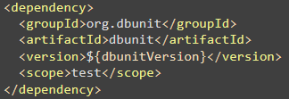
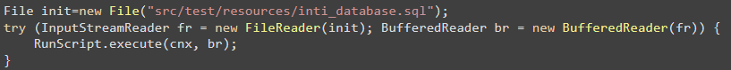
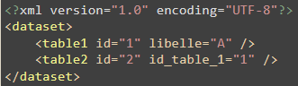
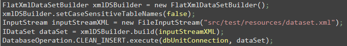

# Formation 

# Tests unitaires...

---
# ...et moins unitaires !

#TuPeuxPasTest

---

* Tour de parole :
  * Avez-vous déjà pratiqué les tests ?
* Questions organisationnelles :
  * Début ? Fin ? Pause ?

---
# Plan

* __Généralités sur les tests unitaires__

* __Le framework JUnit__

* __Junit : Fonctionnalités plus avancées__

* __Conseils, bonnes pratiques et stratégie de test__

* __Isolation des tests : les Fakes et les Mocks__

---

# Plan (suite)

* __Tests et base de données__

* __DBUnit : Une gestion via XML des jeux de test__

---

<section
  data-markdown="chapitre1-generalites.md"
  data-separator-vertical="^--$">
</section>

---

 __DBUnit : Une gestion via XML des jeux de test__ 

---
# Outil de gestion des données de test

 __Question : Sous quelle forme stocker\, insérer les données de test ?__ 

 __DBUnit est un framework permettant la gestion des données de test via fichiers XML \(appelé « dataset »\)__ 

 __En utilisation dans plusieurs applications du parc Insee__ 

 __Moins utilisé maintenant car assez verbeux et coût en maintenance__ 

---
# Digression : Les étapes d’un test

*  __Avant le test :__ 
  *  __Ouvrir une connexion à la base__ 
  *  __Créer la structure de la base__ 
  *  __Remplir la base avec les données utiles au test qui va suivre__ 
  *  __Fermer la connexion__ 
*  __Test__ 
*  __Après le test :__ 
  *  __Rien si vous avez bien conçu votre affaire ;\-\)__ 
  *  __Nettoyer un peu le contenu de la base sinon__ 

---
# DBUnit : Exemple

*  __Installation :__ 
*  __Exécution d’un script pour créer le schéma :__ 
*  __Constitution d’un dataset contenant les données de test :__ 

---
# DBUnit : Chargement dataset

*  __On charge ensuite le contenu du fichier XML dans la base de données :__ 
*  __Conclusion : DBUnit offre une méthode de gestion des jeux de données de test__ 
*  __Inconvénients :__ 
  *  __Fichier dataset très verbeux__ 
  *  __Coût de maintenance important en cas de modification du modèle de données__ 
  *  __Problème potentiel pour gérer l’ordre d’insertion__ 
*  __Autre solution : Créer les objets en Java\, les insérer avec Hibernate… Mais c’est un autre sujet __ 

 __Merci de votre attention__ 

 __Avez\-vous des questions ?__ 

 _Prénom Nom_    __ __    __Philippe SABAA__ 

Mél : philippe\.sabaa@insee\.fr

Très inspiré du diapo de    __Michael Genet__ 

 __Insee__ 

Établissement :    __SNDI de Nantes__ 

