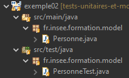
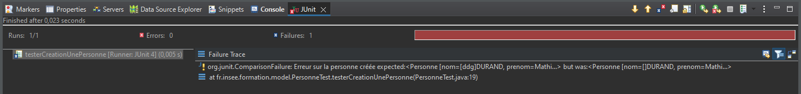

 # Le framework JUnit


--
# Les 5 propriétés d’un bon test

 * __Isolation : Le test porte sur une partie déterminée du code et les interactions avec des parties externes sont contrôlées__ 

 * __Rapidité : Doit s’exécuter en un temps relativement court__ 

 * __Automatisation : Doit pouvoir être lancé avec peu ou pas d’intervention manuelle__ 

 * __Durabilité : Doit rester fonctionnel sur le long terme\, avec un coût de maintenance limité__ 

 * __Reproductibilité : Doit pouvoir être relancé sans conditions préalables et dans tous les environnements__ 


--
# Principes du framework JUnit

 * __JUnit est un outil d’automatisation et de réalisation des tests__ 

 * __Réalisation des tests simplifiée__ 

 * __Contrôles de vérification facilités__ 

 * __Automatisation du lancement des tests__ 

 * __Aide à la mise en place du contexte \(avant le test\, après le test…\)__ 

 * __Intégration avec des outils de build \(Maven par ex\)__ 


--
# Mise en place de JUnit

* __Ajout de la dépendance Maven au pom :__ 

  ```xml
    <dependency>
        <groupId>JUnit</groupId>
        <artifactId>JUnit</artifactId>
        <version>4.13.2</version>
        <scope>test</scope>
    </dependency>
  ```
* __Attention au « scope = test »__ 

* __Pas besoin de la librairie en environnement de production__ 

--
# Mise en place de JUnit

* __Ou pour la version 5 :__ 

  ```xml
		<dependency>
			<groupId>org.JUnit.jupiter</groupId>
			<artifactId>JUnit-jupiter</artifactId>
			<version>5.11.3</version>
			<scope>test</scope>
		</dependency>
  ```

* __On pourra aussi ajouter la librairie ```JUnit-vintage-engine``` pour avoir la compatibilité descendante avec les anciennes versions__

--
# JUnit version 3

*  __Encore en usage dans certaines applis__ 
*  __La classe de test doit hériter de `TestCase`__ 
*  __Convention de nommage pour les méthodes de test : doivent être préfixée par « test » \(ex : `testMethode()`\)__

--
# JUnit version 4

*  __Arrivée des annotations__ 
*  __Plus de convention de nommage : Il suffit d’un `@Test` au\-dessus de la méthode__ 
*  __`@Before`, `@After`\, `@BeforeClass`\, `@AfterClass` : permettent de définir des traitements avant ou après les tests__ 
*  __Assertions : pour des conditions d'acceptation plus élaborées et plus lisibles__

--
# JUnit version 5

* __Refonte globale de JUnit__
*  __Contient 3 modules en un :__
    * __JUnit Platform  : Configuration de l'exécution des tests__
    * __JUnit Jupiter :  API d'écriture des tests__
    * __JUnit Vintage : Compatibilité descendante (JUnit 3 et 4)__
*  __Support de Java 8__ 
*  __Test paramétrés : Exécutions successives avec variation des paramètres__


--
# Structure du code de tests

*  __Déportation du code de test dans un répertoire et des classes dédiées__
* __Utilisation d'un répertoire "ad hoc" :__

* __Pour faciliter la navigation on jumelle code de production/code de test__
--
# Structure du code de tests

*  __Principe de jumelage test/production :__ 
    *  __Une classe de code = Une classe de test \(même nom suffixé Test\)__ 
    *  __Reproduction de l’arborescence de src/main/java dans le répertoire src/test/java__
    *  __Réutilisation des noms de méthodes avec préfixe test et suffixe pour indiquer le cas de test \(ex : `testNomMethodeParametreVide()` \)__ 

--
# Exemple 2 : Premier test JUnit

*  __Test du constructeur de la classe Personne__ 
*  __Structure du code :__
<br/>
*  __Méthode de test :__
    ```java
    @Test
    public void testCreationPersonne()
    ```
*  __Exécution du test__ 
*  __Lecture et compréhension du code__

--
# Les assertions

*  __Intégrées nativement à JUnit__ 
*  __Contenue dans la classe Assert__ 
*  __Ensemble de méthodes statiques \(kesako?\) permettant de réaliser des contrôles de manière simple__

--
# Les assertions

*  __Leur échec provoque le plantage du test :__

*  __Ex :__ 
      *  `Assert.assertEquals(int a, int b)` 
      *  `Assert.assertEquals(Object a, Object b)` 
      *  `Assert.assertTrue(boolean a)` 
      *  `Assert.assertFalse(boolean a)` 
      *  `Assert.assertArrayEquals(String[] a, String[] b)` 
      *  ...

--
# Les assertions

*  __P__    __our chaque méthode assert\* \, 2 signatures :__ 
      *  `Assert.assertEquals(int a, int b)` 
      *  `Assert.assertEquals(String message, int a, int b)` 
*  __Possibilité d’indiquer un message d’erreur pour avoir des infos plus précises__ 
*  __Ex :__
    ```java
        assertEquals(
            "Erreur sur la personne créée", 
            "Personne [nom=" + nom + ", prenom=" + prenom + "]",
            unePersonne.toString()
        );
    ```
--
# Les assertions

*  __Méthode spéciale :__ `Assert.fail()` 
*  __Permet de déclencher la mise en échec du test__ 
*  __Utile par exemple si le traitement aurait du s’arrêter avant__ 


--
 __Exercice 1 : Structurer un test__ 


<span style="color:#3465a4"> __\(Instructions contenues dans le readme\)__ 
