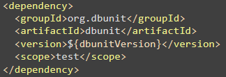

# DBUnit : 
# Une gestion via XML
# des jeux de test

--
# Outil de gestion des données de test

* __Question : Sous quelle forme stocker\, insérer les données de test ?__ 

* __DBUnit est un framework permettant la gestion des données de test via fichiers XML \(appelé « dataset »\)__ 

* __En utilisation dans plusieurs applications du parc Insee__ 

* __Moins utilisé maintenant car assez verbeux et coût en maintenance__ 

--
# Digression : Les étapes d’un test

*  __Avant le test :__ 
    *  __Ouvrir une connexion à la base__ 
    *  __Créer la structure de la base__ 
    *  __Remplir la base avec les données utiles au test qui va suivre__ 
    *  __Fermer la connexion__ 
*  __Test__ 
*  __Après le test :__ 
  *  __Rien si vous avez bien conçu votre affaire ;\-\)__ 
  *  __Nettoyer un peu le contenu de la base sinon__ 

--
# DBUnit : Exemple
*  __Installation :__ 

*  __Exécution d’un script pour créer le schéma :__ 

*  __Constitution d’un dataset contenant les données de test :__ 

--
# DBUnit : Chargement dataset

*  __On charge ensuite le contenu du fichier XML dans la base de données :__ 

*  __Conclusion : DBUnit offre une méthode de gestion des jeux de données de test__ 

--
# DBUnit : Inconénients

*  __Inconvénients :__ 
    *  __Fichier dataset très verbeux__ 
    *  __Coût de maintenance important en cas de modification du modèle de données__ 
    *  __Problème potentiel pour gérer l’ordre d’insertion__ 
* __C'est pourquoi cette solution n'est pas utilisée dans les projets récents...__

*  __Autre solution : Créer les objets en Java\, les insérer avec Hibernate… Mais c’est un autre sujet__ 

--

 __Merci de votre attention__ 

 __Avez\-vous des questions ?__ 

Prénom Nom :   __Philippe SABAA__

Très inspiré du diapo de __Michael Genet__